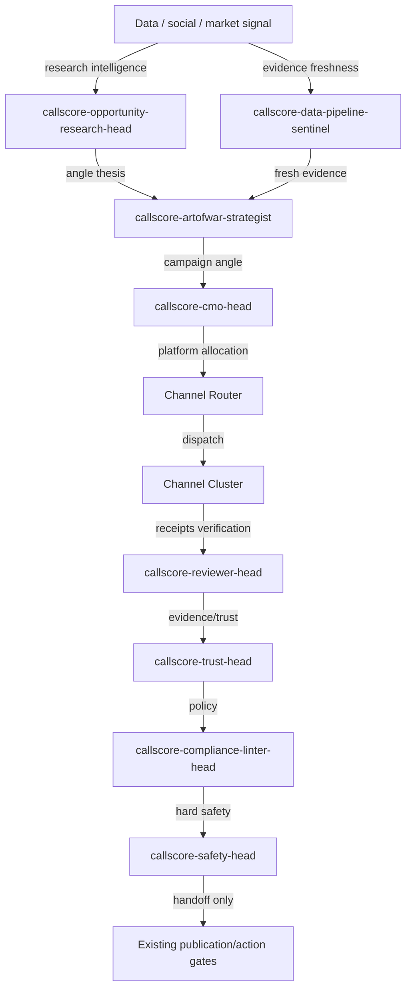
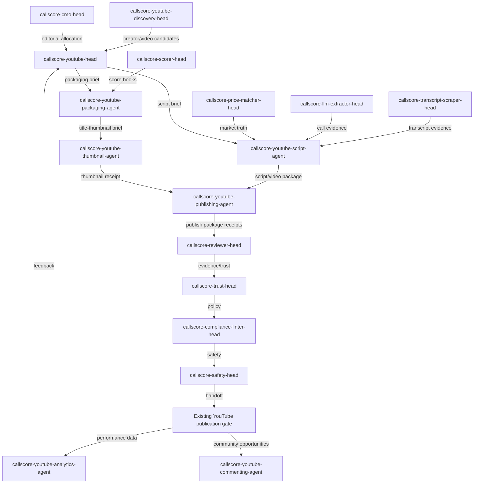
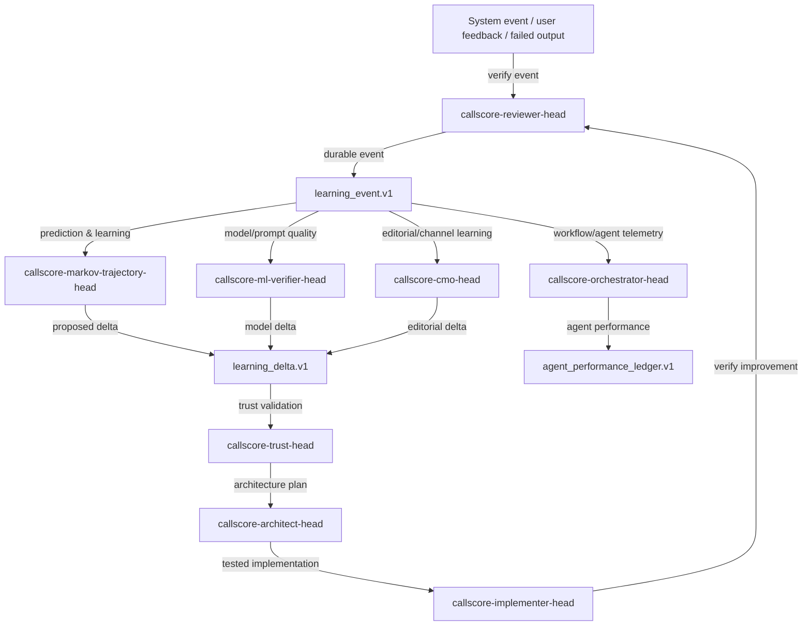

# CallScore Canonical Agent Mapping

## Machine-readable first

The canonical source of truth is:

```text
callscore_canonical_agent_mapping.source.json
```

```json
{
  "existing_agents": 44,
  "proposed_new_required": 7,
  "total_mapped": 51,
  "documentation_format": "markdown_only",
  "diagram_format": "mermaid_only",
  "canonical_rule": "44 agents are the baseline. Upgrade/remap existing agents first. Create new agents only when a real role gap remains after mapping."
}
```

## Core conclusions

1. The 44 agents are canonical baseline agents.
2. Most gaps are solved by upgrading/remapping existing agents.
3. YouTube is the justified exception: it needs 7 new production-channel agents.
4. No new Copy Chief, ML Head, Learning Head, Visual QA Agent, Community Image Agent, Whop Asset Agent, or Email Asset Agent is justified yet.
5. Required runtime artifacts are receipts, hard gates, loops, tests, and audit coverage.

## Required receipt classes

```json
[
  "editorial_angle_receipt.v1",
  "platform_fit_receipt.v1",
  "visual_brief_receipt.v1",
  "visual_qa_receipt.v1",
  "copy_visual_coherence_receipt.v1",
  "same_shit_memory_receipt.v1",
  "learning_event.v1",
  "agent_performance_ledger.v1",
  "learning_delta.v1",
  "experiment_result.v1"
]
```

## Global flow


## YouTube production cluster


## Learning cluster

