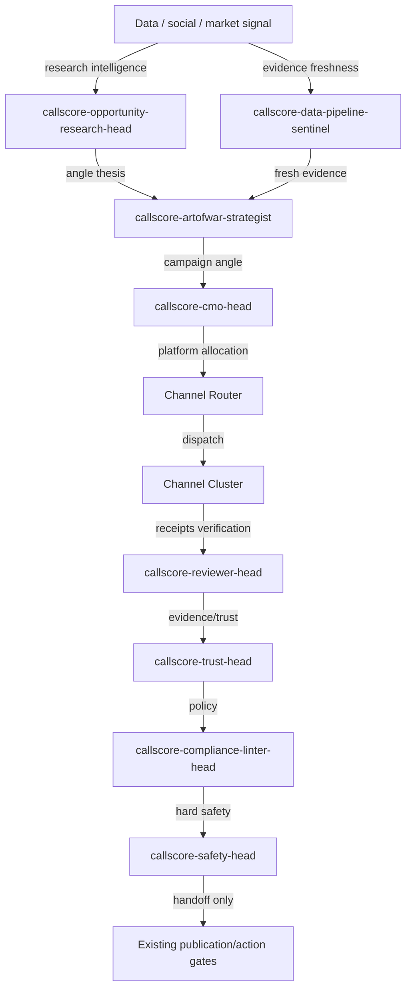
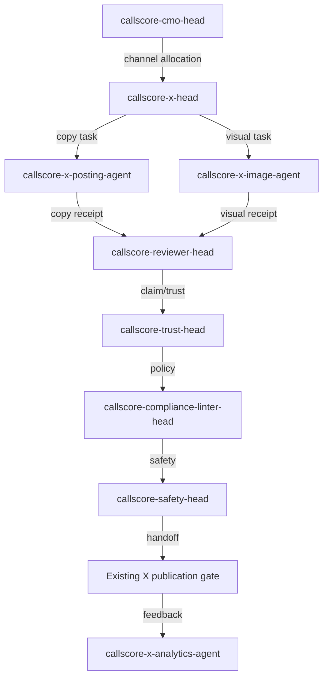
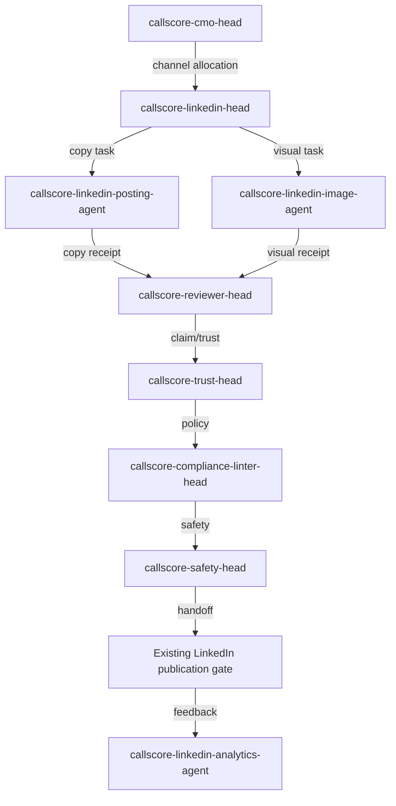
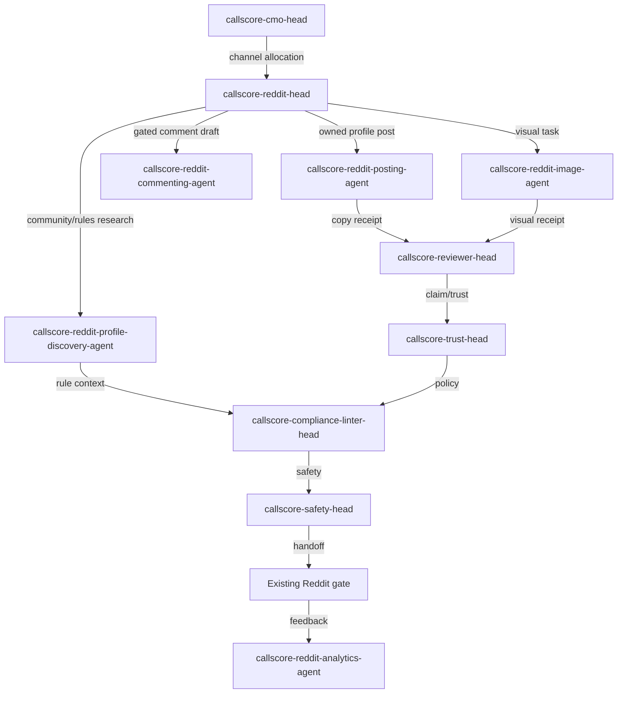
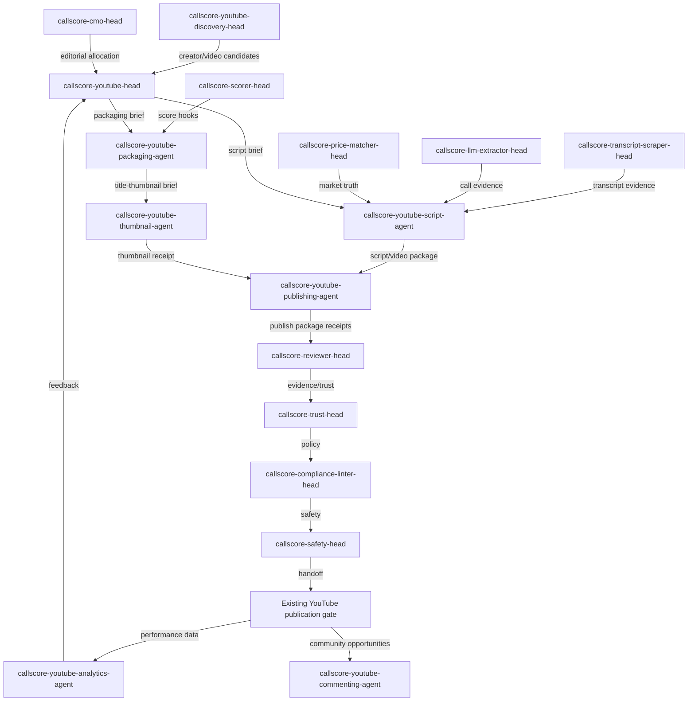
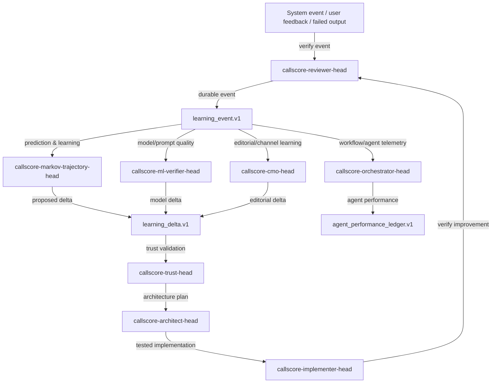
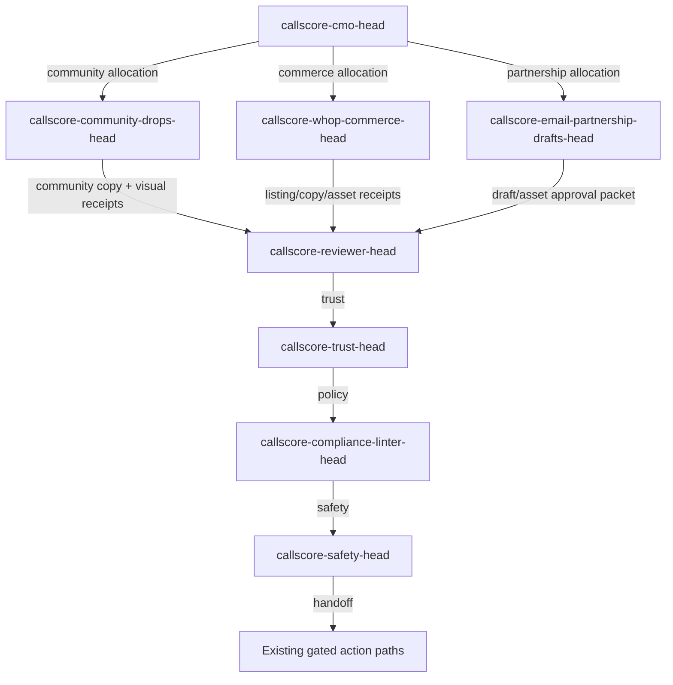

# CallScore Canonical Channel Flow Diagrams

Machine-readable source of truth: `callscore_canonical_agent_mapping.source.json`.

All diagrams are Mermaid. No PNG/SVG/HTML documentation is canonical.

## Global flow

## X flow

## Linkedin flow

## Reddit flow

## Youtube flow

## Learning flow

## Support Surfaces flow

