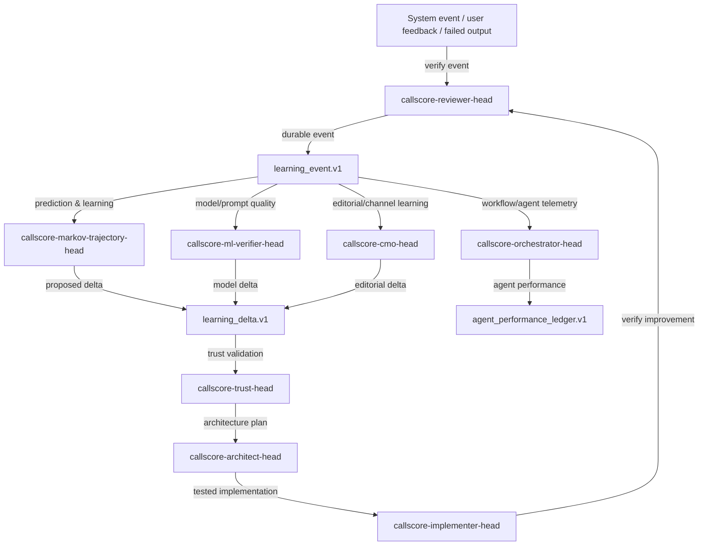

# CallScore Learning Cluster

Machine-readable source of truth: `callscore_canonical_agent_mapping.source.json`.

## Canonical position

Do not create a new `Learning Head` or `ML Head` by default. Upgrade existing agents first.

```json
{
  "learning_cluster": {
    "no_new_learning_head_yet": true,
    "prediction_and_learning_head": "callscore-markov-trajectory-head",
    "ml_quality_head": "callscore-ml-verifier-head",
    "local_model_shadow_runtime": "callscore-gemma-transcript-head",
    "learning_artifacts": [
      "learning_event.v1",
      "agent_performance_ledger.v1",
      "learning_delta.v1",
      "experiment_result.v1"
    ]
  }
}
```

## Learning cluster flow


## Learning cluster matrix

| Agent | Target learning role | Responsibilities | Gap | Upgrade |
|---|---|---|---|---|
| `callscore-cmo-head` | Editorial Supervisor / Copy Chief equivalent | Set channel priorities, allocate campaign themes, interpret cross-channel performance, and sequence multi-channel GTM launches. | Strategy exists but weak content passed; editorial veto not enforced. | Add/require canonical receipts, tests, audit coverage, and graph route alignment. |
| `callscore-compliance-linter-head` | Claim/policy linter | Block unsafe claims, missing caveats, excluded channels, and missing gates before any asset leaves the system. | Needs runtime-enforced receipts and graph placement. | Add/require canonical receipts, tests, audit coverage, and graph route alignment. |
| `callscore-data-pipeline-sentinel` | Evidence truth and freshness gate | Ensure marketing never outruns product/data truth. | Needs runtime-enforced receipts and graph placement. | Add/require canonical receipts, tests, audit coverage, and graph route alignment. |
| `callscore-orchestrator-head` | Runtime supervisor and workflow learning owner | Coordinate agents, enforce Prompt 0 gates, maintain receipts, and keep master-state truthful. | Needs runtime-enforced receipts and graph placement. | Add/require canonical receipts, tests, audit coverage, and graph route alignment. |
| `callscore-architect-head` | Architecture simplification and learning-delta designer | Keep runtime, workplane, provider, and framework architecture simple, explicit, and production-aligned. | Needs runtime-enforced receipts and graph placement. | Add/require canonical receipts, tests, audit coverage, and graph route alignment. |
| `callscore-implementer-head` | Bounded implementation worker for approved deltas | Make small, tested, receipt-backed changes without damaging active runtime. | Needs runtime-enforced receipts and graph placement. | Add/require canonical receipts, tests, audit coverage, and graph route alignment. |
| `callscore-reviewer-head` | Final evidence/receipt verifier and learning-event verifier | Verify claims, receipts, tests, and runtime health before any phase is called complete. | Needs runtime-enforced receipts and graph placement. | Add/require canonical receipts, tests, audit coverage, and graph route alignment. |
| `callscore-trust-head` | Public claim and trust evaluator | Ensure public claims, marketing packets, and product statements are evidence-backed and non-founder reviewed when required. | Needs runtime-enforced receipts and graph placement. | Add/require canonical receipts, tests, audit coverage, and graph route alignment. |
| `callscore-gemma-transcript-head` | Local Model Shadow Runtime Guardian | Maintain VM/local/shadow/main transcript architecture and stop shadow results from contaminating production without gates. | Needs runtime-enforced receipts and graph placement. | Add/require canonical receipts, tests, audit coverage, and graph route alignment. |
