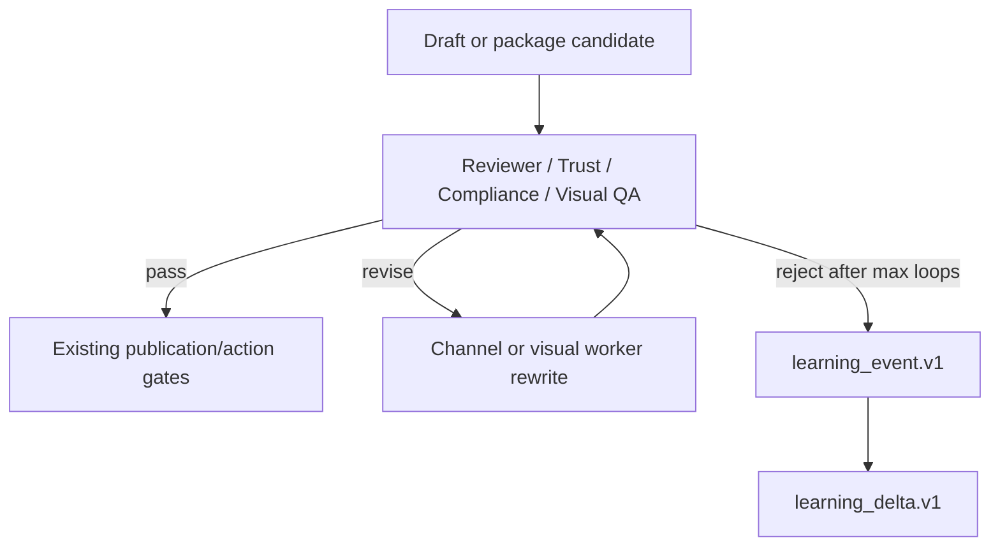
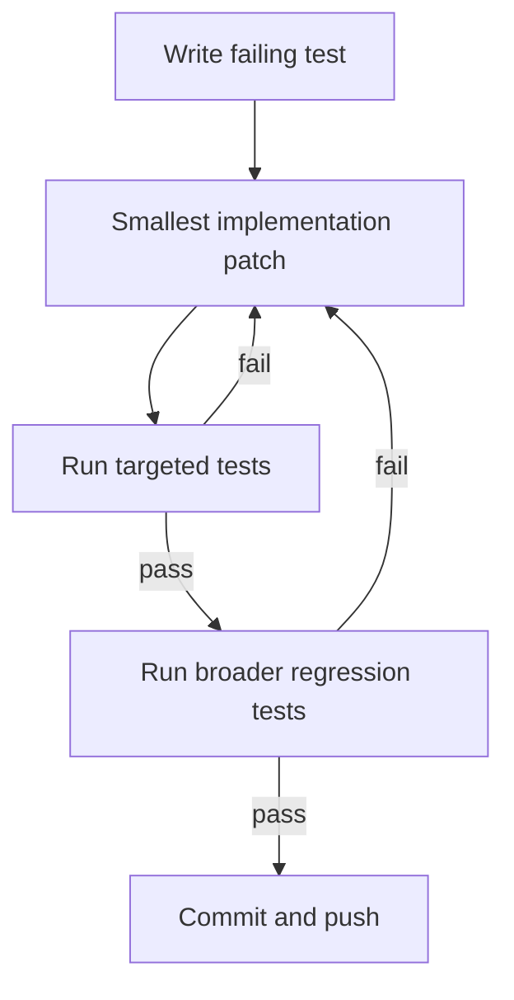

# CallScore Agent Upgrade Plan — Hard Gates and Loops

Machine-readable source of truth: `docs/ops/canonical-agent-mapping/callscore_canonical_agent_mapping.source.json`.

## Goal

Upgrade CallScore agents to the canonical LangChain/LangGraph-aligned structure without weakening existing publication gates.

## Non-negotiable rules

- 44 existing agents are the baseline.
- Upgrade/remap existing agents first.
- Create new agents only when a real role gap remains after mapping.
- YouTube is the current justified exception: 7 new YouTube production-channel agents are required.
- No publication gate redesign.
- TDD workflow is mandatory: failing test first, smallest implementation, pass, then refactor.
- Machine-readable documentation lives in the repo source folder.
- Documentation is Markdown; diagrams are Mermaid.

## Hard gates

1. **Canonical mapping gate**
   - `callscore_canonical_agent_mapping.source.json` must parse.
   - It must account for 44 existing agents plus 7 justified YouTube agents.
   - Markdown docs must be generated from or remain consistent with source JSON.

2. **Soul schema gate**
   - `docs/ops/callscore-channel-head-souls.yaml` must validate.
   - Agent count must be 51.
   - Every agent must resolve action authority.

3. **YouTube cluster gate**
   - Required agents: `callscore-youtube-head`, `callscore-youtube-script-agent`, `callscore-youtube-packaging-agent`, `callscore-youtube-thumbnail-agent`, `callscore-youtube-publishing-agent`, `callscore-youtube-commenting-agent`, `callscore-youtube-analytics-agent`.
   - Discovery must not be overloaded with script, thumbnail, publishing, analytics, or commenting.

4. **Editorial gate**
   - `editorial_angle_receipt.v1` required before platform copy.
   - `platform_fit_receipt.v1` required before channel handoff.
   - Same-thesis cross-posts require rejection or platform-native rewrite.

5. **Visual gate**
   - `visual_brief_receipt.v1` required where channel/content type requires visual support.
   - `visual_qa_receipt.v1` required before visual handoff.
   - `copy_visual_coherence_receipt.v1` required before publish-package readiness.

6. **Learning gate**
   - `learning_event.v1` records failures, user feedback, workflow drift, agent failure, platform blockers, and bad outputs.
   - `agent_performance_ledger.v1` tracks agent usefulness and operational status.
   - `learning_delta.v1` is required before implementation changes derived from a learning event.
   - `experiment_result.v1` records adoption/rejection of system experiments.

7. **Audit gate**
   - CLI audit must report canonical docs, source JSON, souls count, required receipts, YouTube cluster, learning cluster, and Mermaid-only docs.

## Evaluator loops

## Implementation loop

## Step-by-step plan

1. Land canonical Markdown/Mermaid/JSON docs in `docs/ops/canonical-agent-mapping/`.
2. Update tests proving docs are present, machine-readable, Markdown-only, and Mermaid-only.
3. Add the seven justified YouTube production agents to the souls YAML.
4. Add action authority mappings for the seven YouTube agents.
5. Update existing agent-count tests from 44 to 51, preserving the rule that only seven new agents are justified.
6. Update audit script coverage to check canonical docs, YouTube cluster, learning cluster, and source JSON.
7. Commit app changes with passing tests.
8. Snapshot audit script changes into the workplane repo with manifest checksum updates.
9. Push both repos to GitHub.
10. Create Linear project `CallScore` and implementation tasks matching this plan.

## Required tests

- `tests/canonical-agent-mapping-docs.test.ts`
- `tests/canonical-agent-upgrade-plan.test.ts`
- `tests/canonical-youtube-agent-cluster.test.ts`
- Existing soul schema tests
- Existing anti-over-governance tests
- Existing graph/social/public tests where touched

## Stop conditions

- Souls schema fails.
- Any YouTube agent lacks authority mapping.
- Canonical source JSON disagrees with YAML.
- Audit cannot find canonical docs.
- Tests fail without a known isolated reason.
- Publication gates would need weakening.
